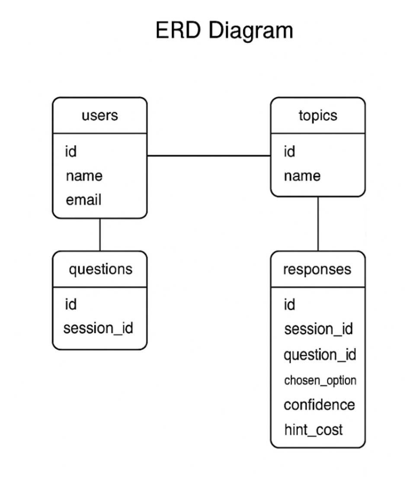
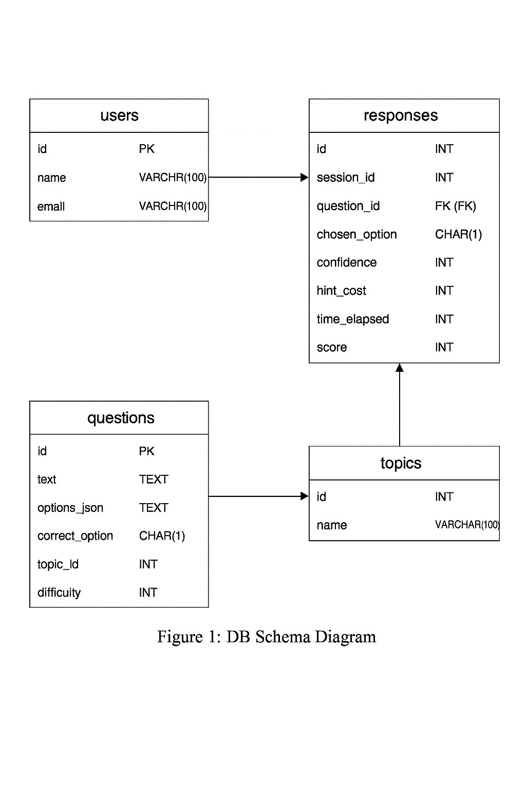

# OmniQuiz+ 🎯

OmniQuiz+ is a **confidence-based online quiz platform** designed for both students and administrators.  
It allows users to take quizzes with hints, confidence levels, and real-time scoring while providing an admin dashboard to manage questions, users, and responses.

---

## 🚀 Features

### 👨‍🎓 User Features
- Register/Login system  
- Take quizzes with:
  - Multiple-choice questions
  - Confidence-based scoring
  - Timer for each question
  - Hints (with penalty)
- Instant feedback after answering  
- Final score with performance chart  
- Download personal results as CSV  

### 👨‍💼 Admin Features
- Secure admin login  
- Add new quiz questions (with options, correct answer, difficulty, topic, and hints)  
- Manage users (view and delete users)  
- View quiz responses in **chart + table format**  
- Export results  

---

## 🛠️ Tech Stack

- **Frontend:** HTML, CSS, JavaScript (Chart.js for graphs)  
- **Backend:** PHP  
- **Database:** MySQL  
- **Hosting:** InfinityFree (or any PHP/MySQL supported server)  

---

## 📂 Project Structure

```
OmniQuizPlus/
│
├── index.html           # Main login/register page
├── quiz.html            # Quiz page
├── style.css            # General styles
├── quiz.css             # Quiz-specific styles
├── main.js              # Frontend logic
│
├── api/                 # Backend PHP APIs
│   ├── login.php
│   ├── register.php
│   ├── get_question.php
│   ├── submit_answer.php
│   ├── results.php
│   ├── results_chart.php
│   ├── results_table.php
│   ├── add_question.php
│   ├── get_users.php
│   └── delete_user.php
│
├── assets/              # Images, logos
│   └── logo.png
│
└── database/            
    └── omniquiz.sql     # Database schema
```

---

## 🗄️ Database Design

### Tables
- **users** → Stores user info (id, name, email, password, role)  
- **questions** → Stores questions, options, correct answer, topic, difficulty, hint  
- **responses** → Stores user responses, confidence, hint usage, score, session_id  

### ER Diagram


### DBT Diagram


---

## ⚡ Installation

1. Clone this repo:
   ```bash
   git clone https://github.com/your-username/OmniQuizPlus.git
   cd OmniQuizPlus
   ```

2. Import the database:
   - Open **phpMyAdmin**  
   - Create a database (e.g., `omniquiz`)  
   - Import `database/omniquiz.sql`

3. Configure database connection in PHP files:
   ```php
   $conn = new mysqli("localhost", "root", "", "omniquiz");
   ```

4. Run the project on XAMPP / InfinityFree / 000WebHost.  

---

## 🎨 UI Highlights
- Modern quiz interface  
- Responsive design  
- Charts & analytics in admin dashboard  
- User-friendly question management  

---

## 📌 Future Enhancements
- Leaderboard system  
- Category/topic-wise quizzes  
- AI-based question recommendation  
- Email notifications for results  

---

## 👨‍💻 Contributors
- **Rudraksh Paliwal** – Project Lead  
- Team Members (if any)  

---

## 📜 License
This project is licensed under the MIT License.
